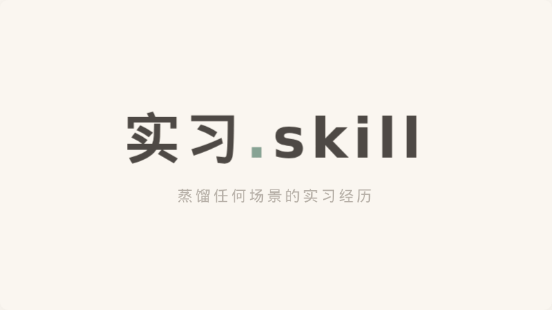

<div align="center">

# 实习.skill 🔥

<p align="center">
  <b>把任何实习经历，提炼成真实可用的竞争力。</b>
  <br>
  <sub>不只是程序员。开发 · 产品 · 运营 · 设计 · 销售 · 市场 · 金融 · 一切岗位</sub>
</p>

[](LICENSE)
[](https://skills.sh)
[](http://makeapullrequest.com)

<p align="center">
  
</p>

</div>

---

## 一键安装

```bash
npx skills install breaker505/resumify
```

支持 Claude Code · Cursor · Codex · Windsurf · Trae · Gemini CLI · GitHub Copilot · Cline · Replit · Zed · Kimi · Qwen 等主流 agent 平台。

---

## Before / After 对比

> 看看实习.skill 能把一段普通描述变成什么。

<table>
  <tr>
    <th width="50%" align="center">👤 用户原始输入</th>
    <th width="50%" align="center">📄 简历版输出</th>
  </tr>
  <tr>
    <td>
        <em>在一家公司实习了三个月，<br>主要做设备的功能验证和兼容性测试。<br>日常是把新版本刷到设备上跑基本功能，记录异常。<br>遇到奇怪的 bug 会抓日志然后提给开发。<br>偶尔也整理测试文档。用了很多命令行工具。</em>
    </td>
    <td>
        <code>参与电商中台服务端接口测试与回归验证，独立完成 6+ 轮全量回归<br>跟踪记录接口异常与线上疑似问题，定位并协助排查 4 个影响核心链路的缺陷<br>撰写接口测试用例与冒烟检查清单，提升团队回归效率</code>
    </td>
  </tr>
  <tr>
    <td align="center"><em>说得像打杂</em></td>
    <td align="center"><code>讲得像有竞争力</code></td>
  </tr>
</table>

> 完整案例 → [examples/dev/case-internet-qa-intern.md](examples/dev/case-internet-qa-intern.md) · 所有岗位的更多案例 → [examples/](examples/)

---

## Before / After Comparison

> See what resumify can do with an ordinary intern description.

<table>
  <tr>
    <th width="50%" align="center">👤 Raw Input</th>
    <th width="50%" align="center">📄 Resume Output</th>
  </tr>
  <tr>
    <td>
        <em>I interned at an internet company for three months, mainly doing server-side API testing and regression. Daily work was writing test cases, running regressions, and tracking anomalies. When I found flaky bugs I grabbed API logs and reported them to devs. Also helped organize test reports. Tools: Charles, Postman, etc.</em>
    </td>
    <td>
        <code>Participated in server-side API testing &amp; regression for e-commerce mid-platform, independently completing 6+ full regression cycles<br>Tracked API anomalies and suspected production issues, assisting in diagnosing 4 core-chain defects<br>Authored API test cases and smoke checklists, improving team regression efficiency</code>
    </td>
  </tr>
  <tr>
    <td align="center"><em>Sounds like grunt work</em></td>
    <td align="center"><code>Sounds like competitive experience</code></td>
  </tr>
</table>

---

## 你的实习不是流水账。它只是还没被提炼。

很多实习生的困境不是因为没做事，而是：

> 👉 一个实习生做了三个月，见了真实的产品验证流程、跟踪过线上问题、参与过联调，但简历上只写 "负责设备功能验证"。
>
> 面试官以为：他只是在跑脚本。
> 实际上他：参与了完整的产品验证链路，能独立排查问题。

这就是 **实习.skill** 要解决的问题。

---

## 效果速览

### 场景：互联网测试实习 → 求职后端 / 测试开发

<details>
<summary><b>👤 用户原始输入</b>（点击展开）</summary>

> 在一家互联网公司实习了三个月，主要做服务端的接口测试和回归验证。日常工作就是根据产品需求写测试用例，然后拿着环境跑一轮回归，记录有没有异常。遇到偶然复现的 bug，会抓接口日志然后录屏复现步骤提给开发。偶尔也会帮忙整理测试报告。用了很多工具，包括 charles、postman 之类的。

</details>

#### 📄 简历版输出
```
- 参与电商中台服务端的接口测试与回归验证，独立完成 6+ 轮全量回归
- 跟踪记录接口异常与线上疑似问题，定位并协助排查 4 个影响核心链路的缺陷
- 撰写接口测试用例与冒烟检查清单，提升团队回归效率
```

#### 🎙️ 面试口述版输出
```
我实习主要做服务端接口的功能验证和回归测试。
日常流程是产品需求评审后，我先根据接口文档编写测试用例，
然后在测试环境上跑一轮回归，确认核心接口都正常。
如果发现偶尔复现的 bug，我会抓接口请求和响应日志，
结合录屏把复现条件和步骤整理清楚后提交给开发。
这段经历让我对服务端系统的开发-测试-上线流程有了完整的认知。
```

#### ✨ 核心亮点
```
✅ 接触过真实开发链路和活动发布节奏
✅ 能把"点点点"讲成"有质量意识"  
✅ 对后端/测试岗的迁移价值：接口理解、排查思路、协作效率
```

> 完整案例 → [examples/dev/case-internet-qa-intern.md](examples/dev/case-internet-qa-intern.md)

---

### 场景：电商运营实习 → 求职运营/市场

<details>
<summary><b>👤 用户原始输入</b>（点击展开）</summary>

> 在一家电商公司实习了三个月，日常写商品文案、做活动页、盯数据报表。出过几篇爆款文案，也帮店铺做了详情页优化。工具主要用生意参谋和 Excel。

</details>

#### 📄 简历版输出
```
- 独立撰写 30+ 篇商品文案，打造 3 篇 10 万+ 爆款内容
- 参与大促活动页面设计与优化，活动期 GMV 环比增长 25%
- 利用生意参谋进行竞品分析，输出 5 份数据驱动的选品建议报告
```

#### 🎙️ 面试口述版输出
```
我在电商公司的实习主要围绕内容运营和活动运营两个方向。
日常工作是写商品文案和活动文案，同时跟踪文案的点击率和转化率。
最有成就感的是有 3 篇文案成了爆款。后来我主动做了竞品分析，
发现我们的详情页描述可以更结构化。跟运营主管沟通后改版了页面，
改版后转化率有明显提升。
这段经历让我对电商运营的"内容 → 流量 → 转化"链路有了实际认知。
```

> 完整案例 → [examples/operations/case-ecommerce-intern.md](examples/operations/case-ecommerce-intern.md)

---

## 输出长什么样

每次处理完，你会得到这份《实习提炼报告》：

```
1. 核心定位        → 这段实习本质属于什么
2. 简历版          → 直接可写进简历
3. 面试口述版      → 面试时怎么讲
4. STAR 亮点       → 最值得讲的一件事
5. 核心亮点提炼    → 这段经历值钱在哪
6. 岗位适配建议    → 不同岗位怎么写
7. 诚实警告        → 哪些不能硬讲
```

---

## 适合谁

| 人群 | 说明 |
|------|------|
| 🧑‍💻 开发实习生 | 后端、前端、移动、嵌入式、测试 |
| 📱 产品实习生 | PM、用研、数据分析、增长 |
| 📊 运营实习生 | 新媒体、电商、用户、内容 |
| 🎨 设计实习生 | UI/UX、交互、视觉、动效 |
| 💼 市场/销售实习生 | BD、市场、销售、品牌 |
| 💰 金融/职能实习生 | 量化、风控、HR、法务、财务 |
| 🌏 留学生 | 中英文简历兼顾 |
| 🔄 转行求职者 | 找到已有经历和目标岗位的迁移点 |

---

## 怎么用

### 方式一：直接用（最快）

复制下面这段话，替换你的实习描述，发给任意 AI 助手：

```
我是一个实习生，下面是我的实习经历：

[在这里描述你的实习内容，越具体越好]

请帮我做一份《实习提炼报告》：
1. 核心定位
2. 简历版（2-4条bullet）
3. 面试口述版
4. STAR亮点
5. 核心亮点提炼
6. 岗位适配建议
7. 诚实警告（哪些不能硬讲）

我的目标岗位是：[写你的目标岗位]
```

### 方式二：使用完整 Prompt（推荐）

用 [SKILL.md](SKILL.md) 里的完整 Prompt，AI 输出更稳定、更专业。

### 方式三：使用模板（最结构化）

从 [templates/](templates/) 目录按岗位选择对应的输入模板，填好发给 AI。

---

## 仓库结构

```
resumify/
│
├── README.md              ← 你正在看的这个文件
├── SKILL.md               ← Skill 本体（完整 Prompt + 方法论）
├── LICENSE                ← MIT License
│
├── assets/
│   └── hero.gif           ← Hero 动画
│
├── examples/              ← 按岗位分类的真实案例
│   ├── dev/               ← 开发岗案例
│   ├── product/           ← 产品岗案例
│   ├── operations/        ← 运营岗案例
│   ├── sales/             ← 销售/市场岗案例
│   ├── design/            ← 设计岗案例
│   └── finance/           ← 金融/职能岗案例
│
├── templates/             ← 按岗位定制的输入模板
│   └── quick-start.md     ← 通用快速模板
│
├── guides/                ← 进阶使用指南
│   ├── for-interview.md   ← 面试准备专用
│   ├── for-resume.md      ← 简历优化专用
│   └── multilingual.md    ← 中英双语简历指南
│
└── references/
    └── methodology.md     ← 方法论说明
```

---

## 和普通简历润色的区别

| 维度 | 普通润色 | 实习.skill |
|------|---------|-----------|
| 做什么 | 把原话写顺 | 识别价值 + 提炼表达 |
| 是否区分深度 | ❌ 不区分 | ✅ 区分做过 / 协助过 / 只见证过 |
| 是否按岗位改写 | ❌ 不处理 | ✅ 按目标岗位调整表达重心 |
| 是否指出短板 | ❌ 不会 | ✅ 诚实告知哪些不能硬讲 |
| 覆盖岗位 | 仅限技术 | ✅ 所有岗位通用 |
| 输出形式 | 单一版本 | ✅ 简历 + 面试 + STAR 多版本 |

---

## 贡献

这个项目欢迎一切形式的贡献：
- 提交你自己的实习案例（匿名也行） → [examples/](examples/)
- 反馈你使用后的改进建议 → Issues
- 帮助完善模板和指南 → Pull Requests

> 你的案例会被更好地表达，别人的案例会让这个 skill 越来越强。

---

## 许可

MIT License © breaker505

---

<div align="center">
  <sub>
    <b>实习不只是经验，是竞争力。</b>
    <br>
    <a href="https://github.com/breaker505">breaker505</a>
    ·
    <a href="https://breaker505.github.io">博客</a>
  </sub>
</div>
